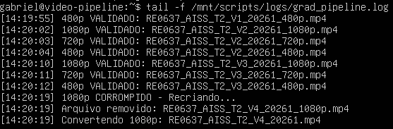
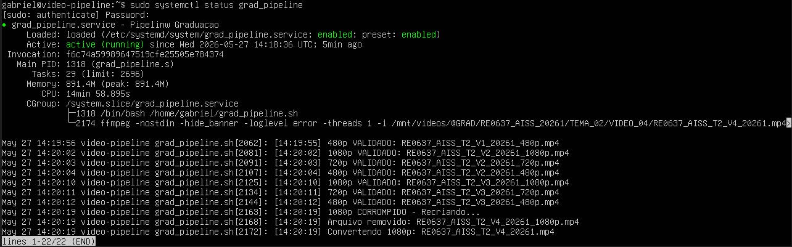
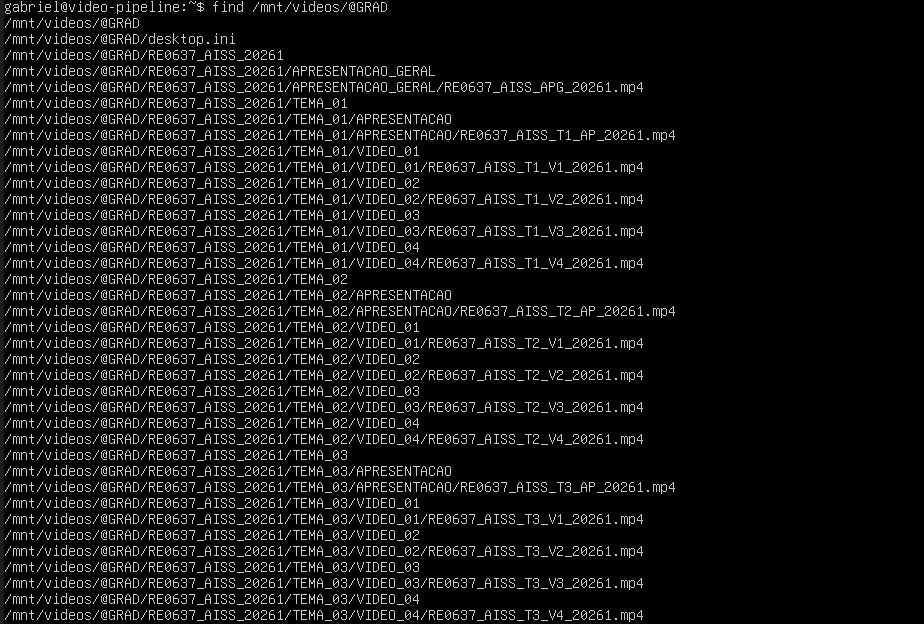
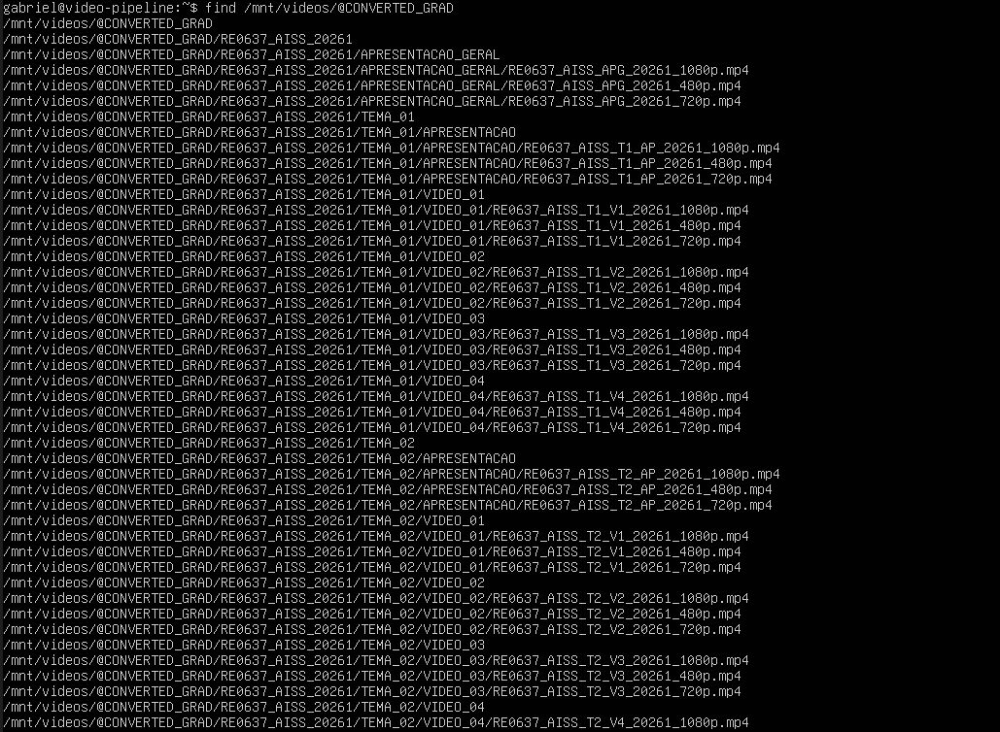
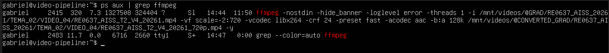
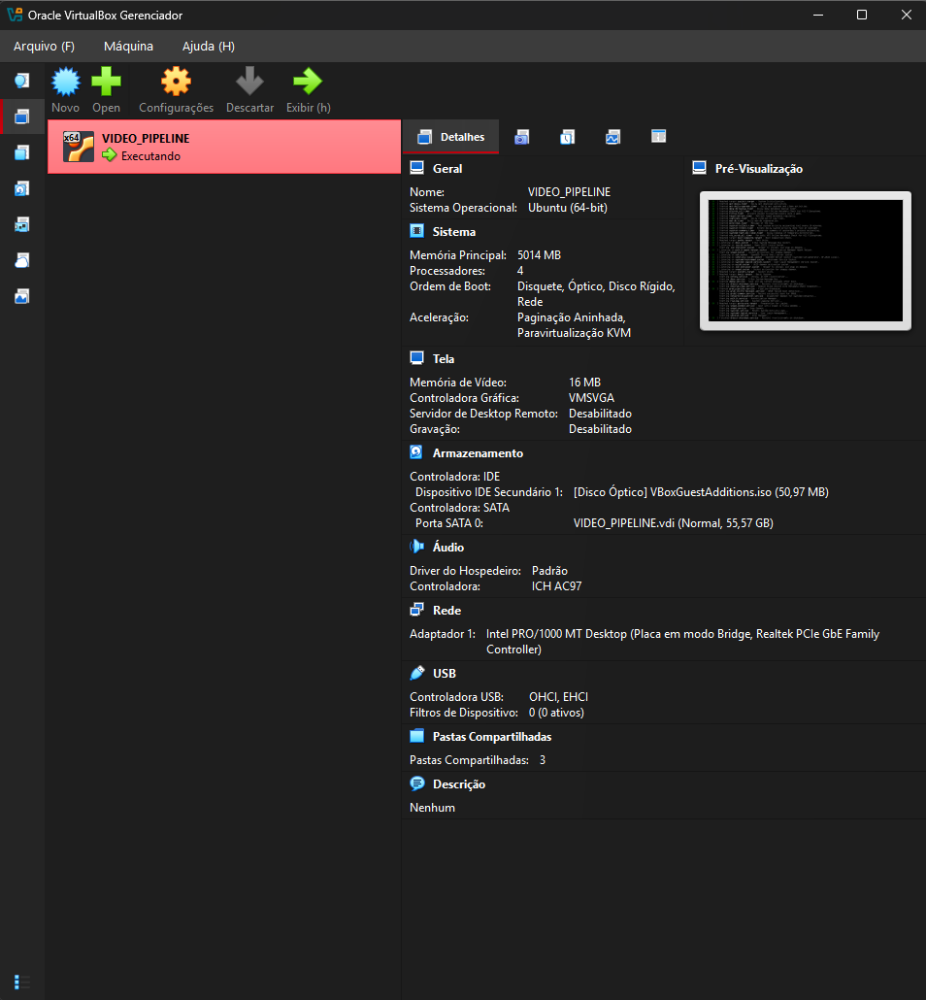

# Video Processing Pipeline

Automated video processing pipeline focused on institutional media organization, transcoding, validation and continuous monitoring.

---

# Overview

This project was developed as a Proof of Concept (POC) for scalable institutional video processing infrastructure.

The pipeline continuously monitors raw media folders, automatically generates multiple resolutions, validates converted files and performs self-healing operations when corrupted outputs are detected.

---

The pipeline continuously monitors...

# Main Features

* Automated video transcoding
* Multi-resolution generation
* 1080p / 720p / 480p processing
* Automatic mirrored folder structure
* Continuous directory monitoring
* Automatic validation system
* Corrupted file recovery
* Retry system
* Self-healing workflow
* Logging system
* Headless execution
* Systemd service integration
* Automatic startup on boot

---

# Folder Architecture

RAW Structure:

```txt
@GRAD/
└── COURSE
    └── TOPIC
        └── VIDEO
            └── class.mp4
```

Converted Structure:

```txt
@CONVERTED_GRAD/
└── COURSE
    └── TOPIC
        └── VIDEO
            ├── class_1080p.mp4
            ├── class_720p.mp4
            └── class_480p.mp4
```

---

# Processing Flow

1. Monitor RAW directory
2. Detect new media
3. Validate copy completion
4. Generate multiple resolutions
5. Validate output duration
6. Detect corrupted files
7. Automatically re-render invalid outputs
8. Organize converted structure
9. Restart monitoring cycle

---

# Validation System

The pipeline uses FFprobe to compare original and converted media duration.

If the converted file exceeds the allowed tolerance threshold, the system automatically:

* removes corrupted outputs;
* waits filesystem unlock;
* reprocesses the media;
* validates the file again.

This creates an automated self-healing media workflow.

---

# Technologies

* Ubuntu Server
* Bash Script
* FFmpeg
* FFprobe
* Systemd
* VirtualBox
* GitHub

---

# Infrastructure Design

The project architecture was designed to simulate a resilient institutional media processing environment.

Core infrastructure concepts implemented:

* isolated Ubuntu processing environment;
* headless virtualization;
* automated service lifecycle;
* continuous monitoring loop;
* automated recovery workflow;
* mirrored output architecture;
* scalable folder organization.

The pipeline was intentionally designed with scalability in mind, allowing future migration to cloud or distributed infrastructures.

---


# Headless Infrastructure

The environment was configured to operate entirely in headless mode.

Features include:

* automatic VM startup;
* automatic service startup;
* background execution;
* continuous operation;
* reduced manual intervention.

---

# Performance Notes

Initial tests were performed using limited hardware resources under VirtualBox virtualization.

Even under constrained CPU, RAM and I/O conditions, the pipeline demonstrated:

* operational stability;
* continuous monitoring;
* automatic recovery;
* fault tolerance;
* scalable architecture potential.

Future deployment on dedicated infrastructure may significantly increase processing throughput and conversion speed.

---

# Future Improvements

* AWS integration
* Distributed processing
* GPU transcoding
* Dashboard monitoring
* Queue management
* Cloud infrastructure
* Real-time metrics
* Containerization

---

# Architecture Flow

```txt
RAW MEDIA
    ↓
MONITORING
    ↓
COPY VALIDATION
    ↓
TRANSCODING
    ↓
OUTPUT VALIDATION
    ↓
AUTO-HEALING
    ↓
ORGANIZED DELIVERY
```


# Project Status

Current Version:

```txt
V16 Stable Showcase Build
```

Status:

```txt
Operational Proof of Concept
```

---

# Author

Gabriel Dutra

---

# Disclaimer

This repository is intended as a technical showcase and architectural demonstration.

Sensitive institutional structures, real datasets and production infrastructure details were intentionally omitted.

# Monitoring & Reliability

The pipeline continuously validates operational integrity during execution.

Implemented reliability strategies include:

* continuous monitoring cycles;
* retry logic;
* validation tolerance checks;
* automatic corrupted file replacement;
* filesystem stabilization delays;
* service persistence using systemd.

These mechanisms help ensure operational resilience even in low-resource environments.

---

# Monitoring Example

Real-time monitoring and logging system during continuous execution.



---

# Systemd Service

Persistent background execution managed through systemd.



---

# RAW Media Structure

Institutional RAW media organization structure.



---

# Converted Media Structure

Automatically mirrored converted media structure.



---

# FFmpeg Processing

Live transcoding processes during pipeline execution.



---

# Headless Infrastructure

Virtualized Ubuntu Server operating in fully headless mode.


